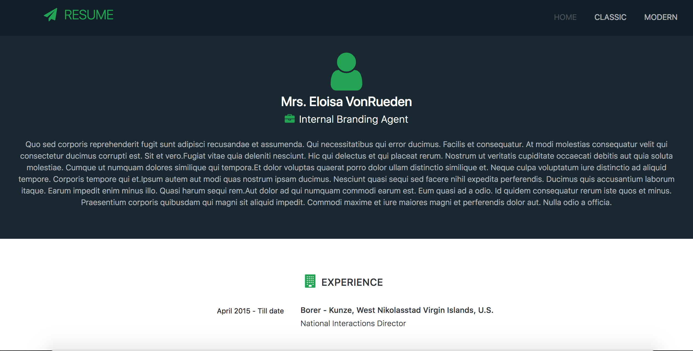

# resume
Professional Developer Resume Template built using Node JS, React , Graphql and Relay Modern



Included a dummy profile created using faker - [faker](https://github.com/Marak/Faker.js)

* [Setup](#setup)
* [Usage](#usage)
  * [compile](#compile)
  * [start](#start)
  * [build](#build)

## Setup

```
git clone https://github.com/kadharmfn/resume.git
cd resume
npm install
```

## Usage

### `compile`
To compile and generate graphql fragements
```
npm run relay
```

### `start`
Start the development server with graphql proxy 
```
npm run start
```

### `build`
Build a production ready version of the code:
```
npm build
```
